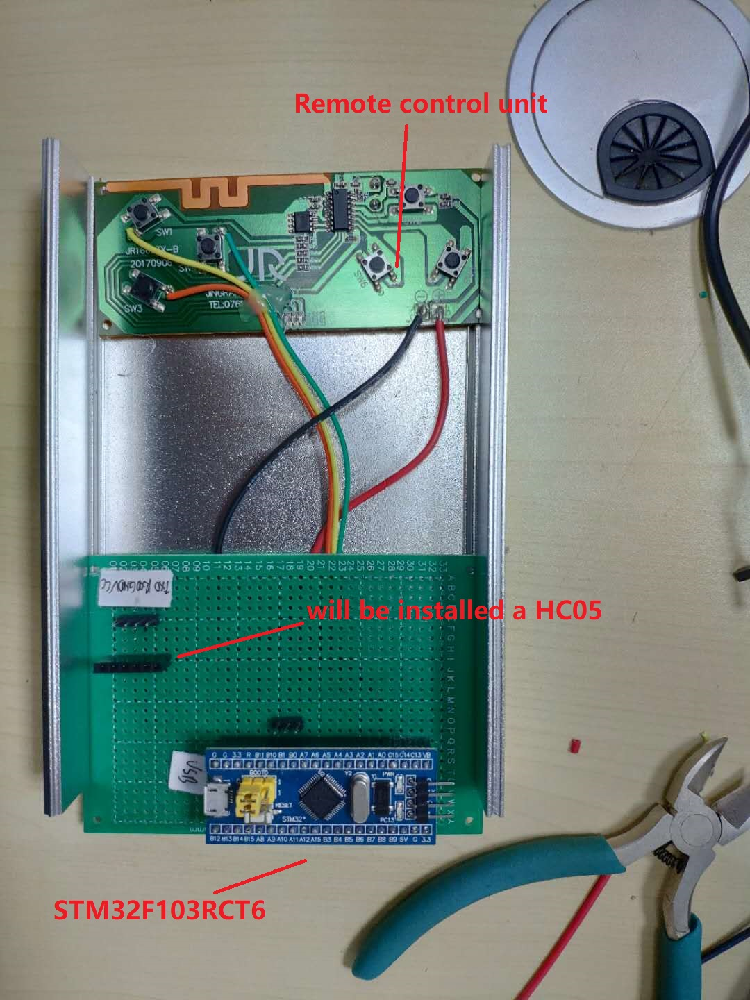

# A-demonstration-system-charging-payment-system-based-on-blockchain
This is a demonstration system about charging payment based on blockchain between electrical vehicle and charging pile, which has been used in two galleries.

[Demo video](https://www.youtube.com/watch?v=AlsK573OCzE)

**Start button**
This is a box with a button in the center, when you press down the button, the button will be lighted. At the same time, the whole demonstration system will be launched. The controller is the stm32f103rct6, the signal LED information will be transmitted by HC05 (Bluetooth module), the movement of simulated electrical vehicle will be controlled by its original remote-control unit based on 433 communication.

 

 

**Simulated electrical vehicle**

 

**Simulated charging pile**

 

**Whole effect**

 

